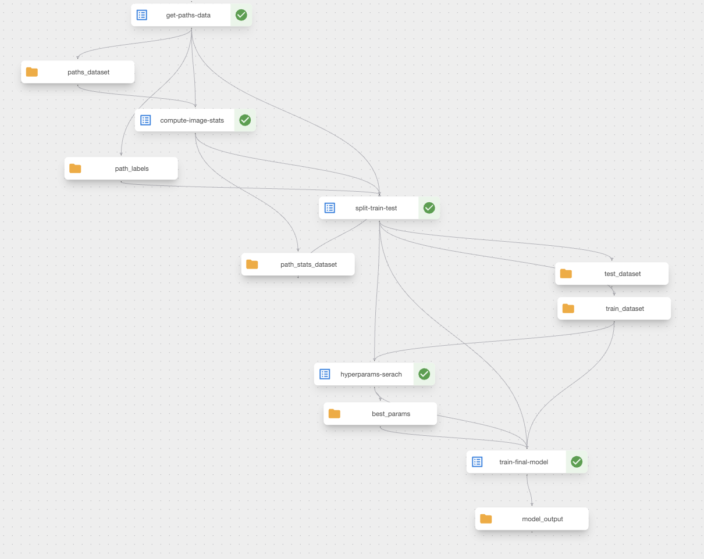

# notes-ml-geo

## Table of Contents

0. [Image-wise Classification](#0-image-wise-classification)
1. [GPS Analytics](#1-gps-analytics)
2. [Spark and Jupyter Notebook](#2-spark-and-jupyter-notebook)
3. [Kubeflow on Kind cluster](#3-kubeflow-on-kind-cluster)
4. [Example kubeflow for Sentinel 2 Image-wise Classification](#4-example-of-kubeflow-for-sentinel-2-image-wise-classification)
5. [License](#5-license)

## 0. Image-wise Classification

* [Starter notebook for image-wise classification tasks](https://github.com/giobbu/notes-ml-geo/blob/main/notebooks/image-classification/0_sentinel2_quick_ml_starter.ipynb)
* [Feature engineering techniques to improve baseline models](https://github.com/giobbu/notes-ml-geo/blob/main/notebooks/image-classification/1a_sentinel2_feature_engineering.ipynb)
* [Different flavours of global interpretability](https://github.com/giobbu/notes-ml-geo/blob/main/notebooks/image-classification/1b_global_interpretability.ipynb)
* [In-Depth Model Analysis and Debugging  (inprogess)](https://github.com/giobbu/notes-ml-geo/blob/main/notebooks/image-classification/1c_full_debuggability.ipynb)
* [End-to-end ML pipeline using Kubeflow for scalable workflows](https://github.com/giobbu/notes-ml-geo/blob/main/notebooks/image-classification/2_kfp_sentil_pipeline.ipynb)

## 1. GPS Analytics
* [Starter notebook for GPS processing with Polygons broadcasting](https://github.com/giobbu/notes-ml-geo/blob/main/notebooks/gps-analytics/gps_sample_analytics.ipynb)
* [Streamline timeseries forecasting with Feast](https://github.com/giobbu/notes-ml-geo/blob/main/notebooks/gps-analytics/spark_feast_forecast_ml.ipynb)


## 2. Spark and Jupyter Notebook
You can find a detailed step-by-step guide in:

`notebooks/gps-analytics/README.md`

Otherwise, for one-shot deployment (from within `notebooks/gps-analytics`):
```bash
./deploy_docker_spark_jupyter.sh "$PWD"
```

accessing PySpark inside the container:
```bash
docker exec -i -t <name-container> /usr/local/spark/bin/pyspark
```

access Spark UI:
```bash
http://localhost:4040
```

## 3. Kubeflow on Kind cluster
You can find a detailed step-by-step guide in:

`notebooks/image-classification/README.md`

Otherwise, for one-shot deployment (from within `notebooks/image-classification`):
```bash
./deploy_kubeflow_pipeline.sh
```

Check pods status:
```bash
./check_pods_status.sh
```

Shutdown the cluster:
```bash
./shutdown_kind.sh
```

#### Notes
* Ensure Docker and Kind are installed and running
* Deployment may take a few minutes depending on your system
* Use the pod status script to wait until all services are ready

## 4. Example of Kubeflow for Sentinel 2 Image-wise Classification

Check [End-to-end ML pipeline using Kubeflow for scalable workflows](https://github.com/giobbu/notes-ml-geo/blob/main/notebooks/image-classification/2_kfp_sentil_pipeline.ipynb)




